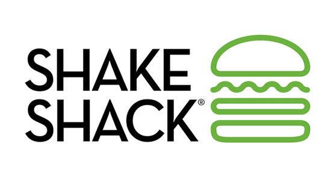
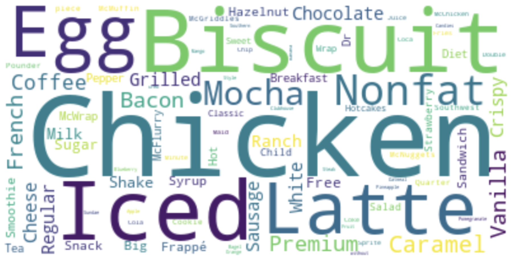
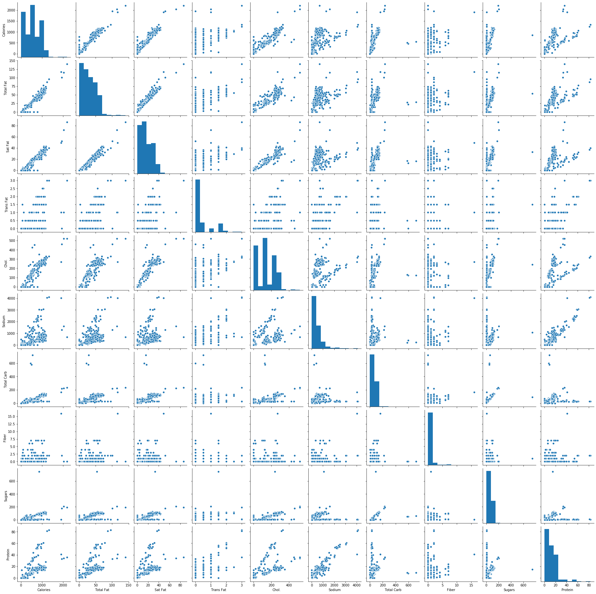
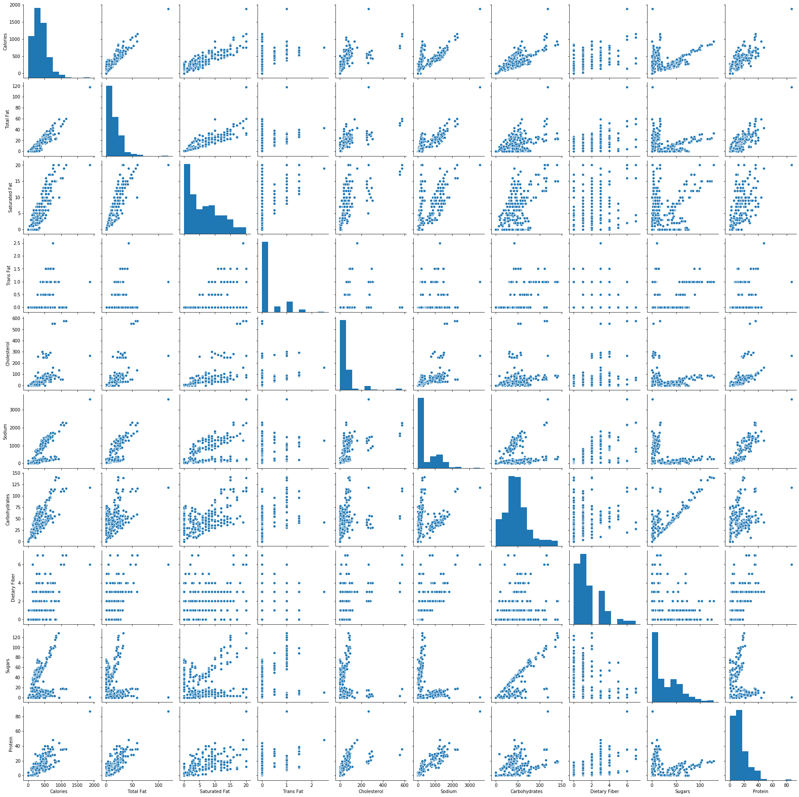
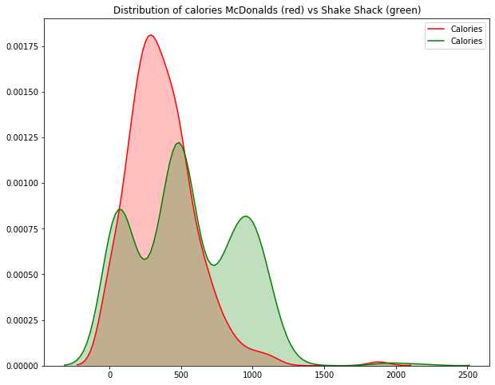
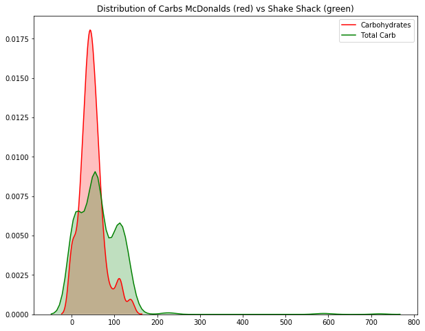
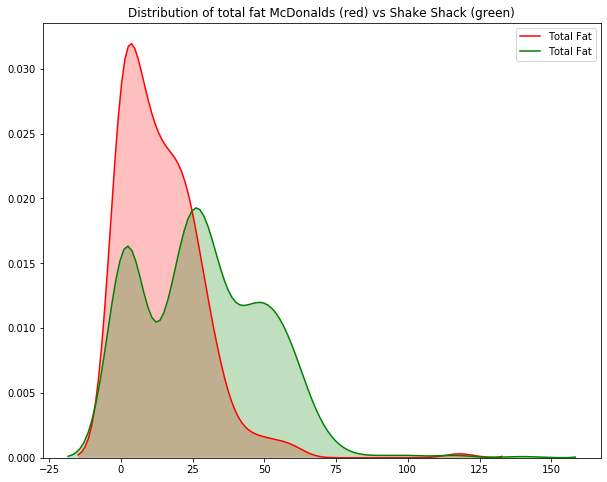
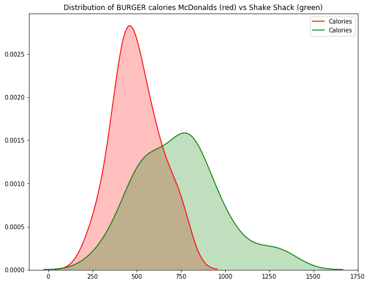

# Statistically Better Burger
The goal of this project is to compare two burger giants - McDonald's and Shake Shack. 

Data used is the nutritional information about the menu items of both restaurants. Additionally, I have created wordclouds to get a better look at the items:

Shake Shack:

McDonald's:

By visually comparing the distributions of calories, fats, fiber, carbs, etc. one can make a choice between two restaurants. 

Pairplot for Shake Shack:

Pairplot for McDonald's:

Here are some comparative visualizations:

Here are burgers comparison specifically:

Finally, since I wanted to statistically prove that Shake Shack is different from McDonald's, I did a t-test. With statistic=-7.12 and p-value=2.1e-12 for calories, I am concluding that Shake Shack is a better treat if you are on a diet. Also, with statistic=-11.5 and p-value=7.04e-29 for cholesterol, I am also concluding that Shake Shack is good for people watching their cholesterol. Same test for other categories made me certain that Shake Shack is better if you care about your health.
